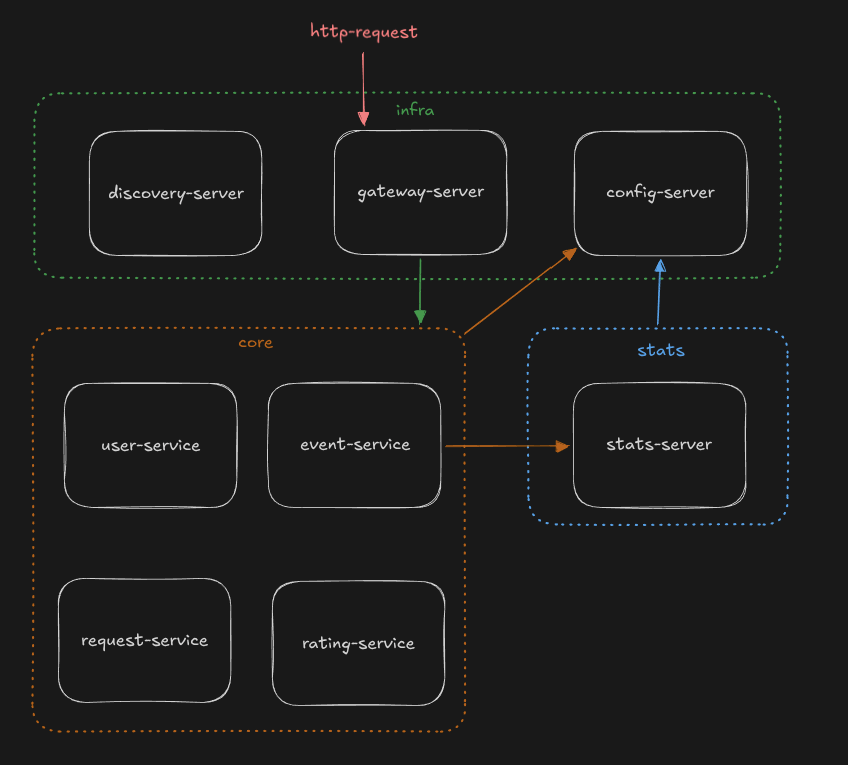
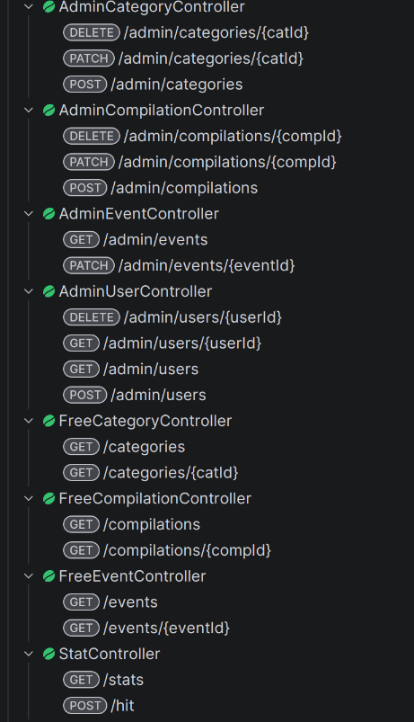
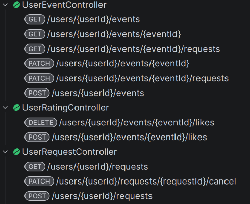
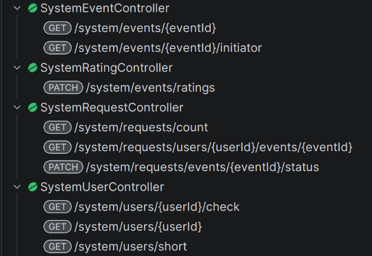
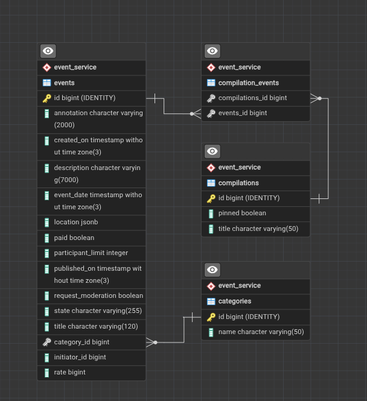
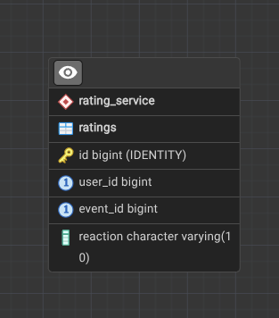
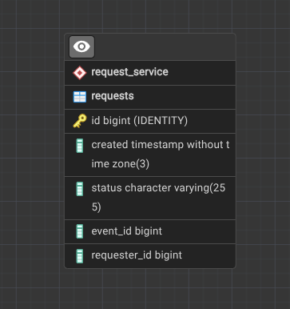
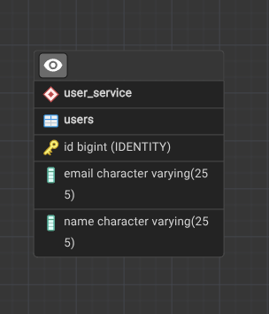
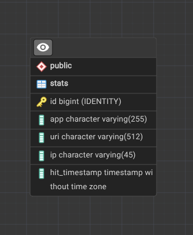

# Explore with me (микросервисная версия)

## Бэкэнд для сервиса поиска мероприятий

### Configuration
configuration files location: infra/config-repo

### Microservice map

### External API

### Internal API

### Database map

ewm-main/event-service  

ewm-main/rating-service  

ewm-main/request-service  

ewm-main/user-service  

ewm-stats/stats-server  
