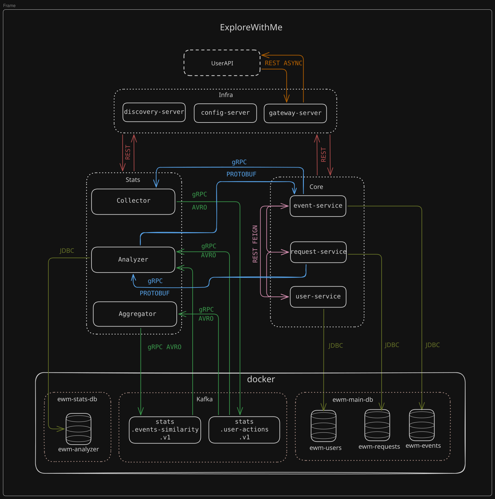
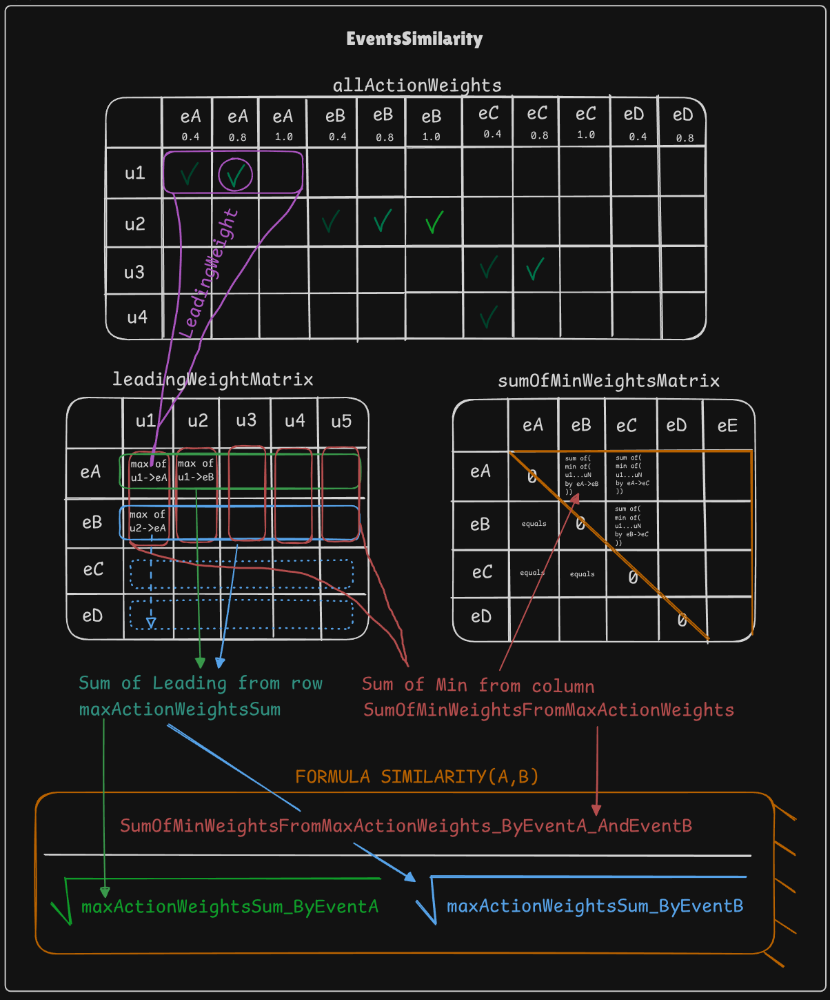
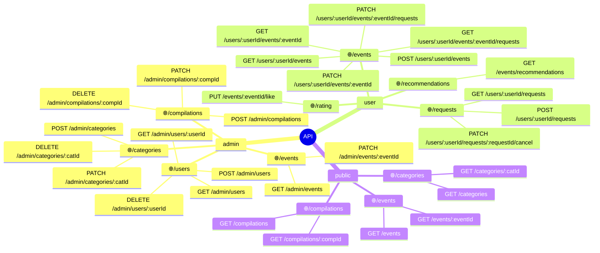
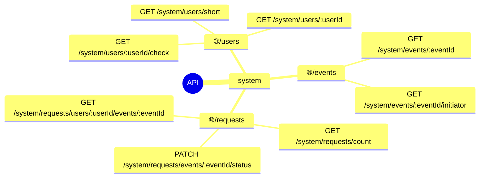
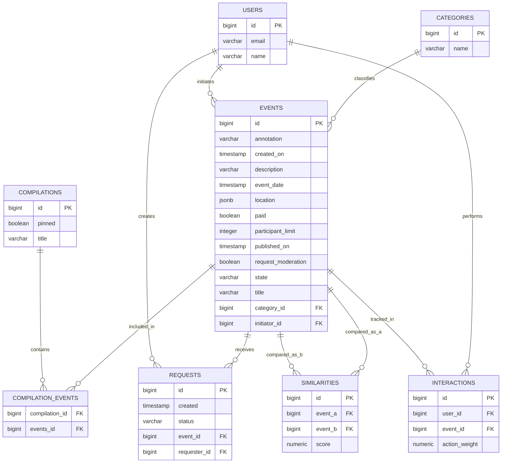

# Explore with me (микросервисная версия)

## Бэкэнд для сервиса поиска мероприятий

### Configuration
configuration files location: infra/config-repo

### Microservice map

### Calculate similarities map

### Matrix example

Матрица ведущих весов (leadingWeightMatrix)  

|     | u1   | u3   | u5   | u7   | u8   | u10  | u11  | u12  | u13  |
|-----|------|------|------|------|------|------|------|------|------|
| e1  |      |      | 0.80 |      |      |      |      |      |      |
| e2  |      |      |      |      |      |      |      |      | 0.80 |
| e4  | 0.40 | 0.80 |      |      |      | 0.40 |      |      |      |
| e5  | 1.00 |      |      |      |      |      |      |      |      |
| e7  |      |      |      |      | 0.80 |      |      |      |      |
| e8  |      |      |      |      |      |      |      | 0.40 |      |
| e9  |      |      |      |      |      |      | 0.80 |      |      |
| e11 |      |      |      |      |      |      |      |      | 0.40 |
| e13 |      |      |      |      |      |      |      |      | 0.40 |
| e14 |      |      |      |      | 0.40 |      |      |      |      |
| e15 |      |      |      | 0.80 |      |      |      |      |      |
| e16 |      |      |      |      |      |      |      | 0.80 |      |
| e17 |      |      |      |      |      | 0.80 |      |      |      |
| e18 |      |      |      |      |      | 0.80 |      | 0.40 |      |
| e20 | 0.80 |      |      |      |      |      |      |      |      |

Матрица числителей (sumOfMinWeightsMatrix)  

|     | e2   | e4   | e5   | e7   | e8   | e11  | e13  | e14  | e16  | e17  | e18  | e20  |
|-----|------|------|------|------|------|------|------|------|------|------|------|------|
| e2  | 0.00 |      |      |      |      | 0.40 | 0.40 |      |      |      |      |      |
| e4  |      | 0.00 | 0.40 |      |      |      |      |      |      | 0.40 | 0.40 | 0.40 |
| e5  |      | 0.40 | 0.00 |      |      |      |      |      |      |      |      | 0.80 |
| e7  |      |      |      | 0.00 |      |      |      | 0.40 |      |      |      |      |
| e8  |      |      |      |      | 0.00 |      |      |      | 0.40 |      | 0.40 |      |
| e11 | 0.40 |      |      |      |      | 0.00 | 0.40 |      |      |      |      |      |
| e13 | 0.40 |      |      |      |      | 0.40 | 0.00 |      |      |      |      |      |
| e14 |      |      |      | 0.40 |      |      |      | 0.00 |      |      |      |      |
| e16 |      |      |      |      | 0.40 |      |      |      | 0.00 |      | 0.40 |      |
| e17 |      | 0.40 |      |      |      |      |      |      |      | 0.00 | 0.80 |      |
| e18 |      | 0.40 |      |      | 0.40 |      |      |      | 0.40 | 0.80 | 0.00 |      |
| e20 |      | 0.40 | 0.80 |      |      |      |      |      |      |      |      | 0.00 |

Таблица знаменателей (eventToLeadingWeightsSum)  

|       | e1   | e2   | e4   | e5   | e7   | e8   | e9   | e11  | e13  | e14  | e15  | e16  | e17  | e18  | e20  |
|-------|------|------|------|------|------|------|------|------|------|------|------|------|------|------|------|
|   Σ   | 0.80 | 0.80 | 1.60 | 1.00 | 0.80 | 0.40 | 0.80 | 0.40 | 0.40 | 0.40 | 0.80 | 0.80 | 0.80 | 1.20 | 0.80 |

### External API

### Internal API

### Database map
